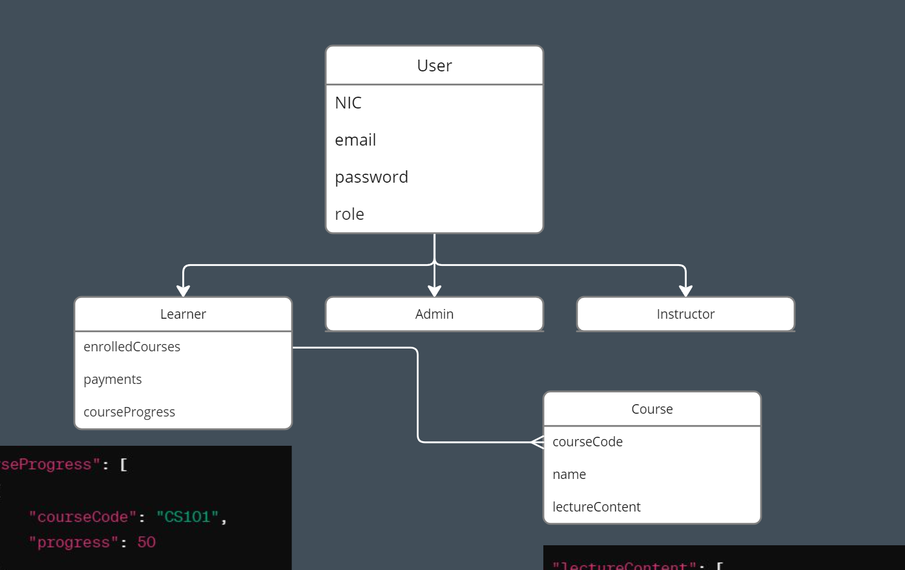

# Microservices Backend using Nodejs, Docker & Kubernetes

### Utilized Ports

```bash
    API_GATEWAY_PORT = 4000
    AUTH_PORT = 4001
    LEARNER_PORT = 4002
    COURSE_PORT = 4003
    PAYMENT_PORT = 4004
```

### Installation

```bash
    npm install
```

### Run

```bash
    npm run dev
```

### Build Docker Image

```bash
    docker compose build
```

### Run Docker Image

```bash
    docker compose up
```

### Kubernetes

```bash
    kubectl apply -f ds-assignment.yaml
```

### Architecture


